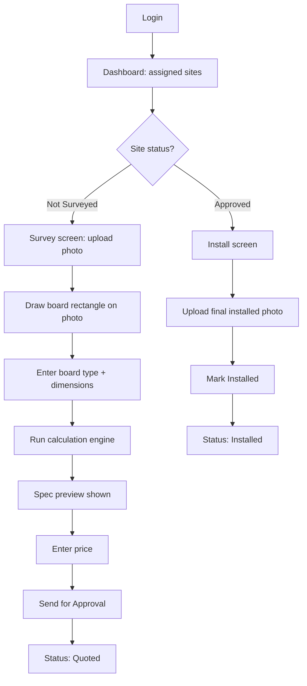
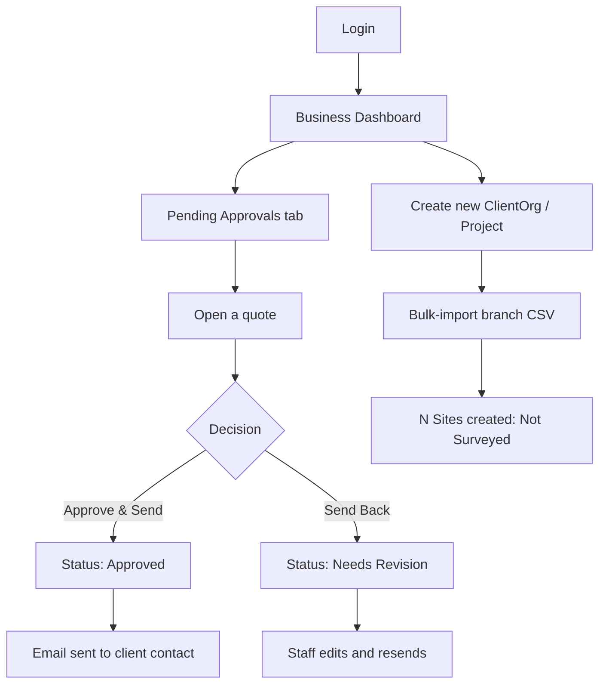
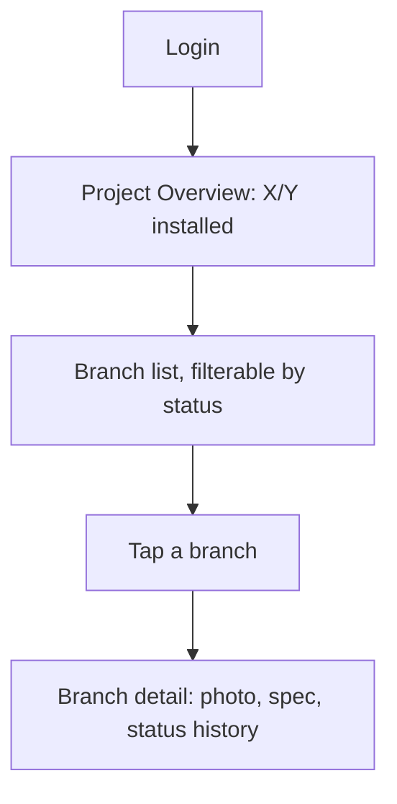
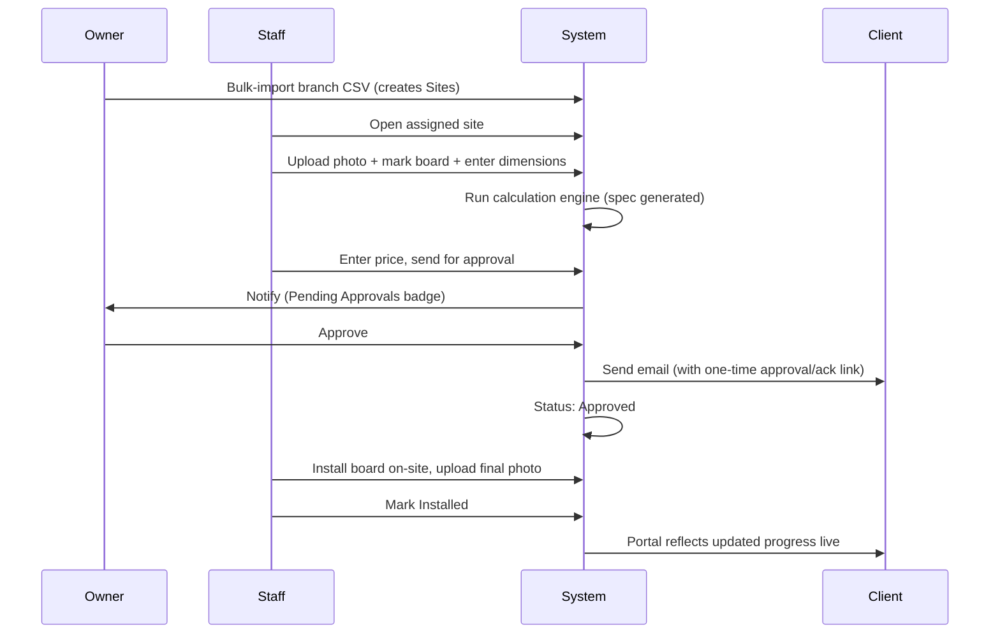

# lineaLED CRM — Product Overview & Workflow

> A live view into how signage rollouts are surveyed, quoted, approved, and installed — built to replace manual, person-dependent coordination with a single source of truth.

---

## 1. What This Is

A lightweight CRM built for **lineaLED**, a signage and LED lighting company, to manage the full lifecycle of a client's signage rollout: from initial branch survey, through cost estimation, through owner approval, to physical installation — with a live progress view for both the internal team and the client.

---

## 2. Why It Exists

Signage businesses like lineaLED currently run almost entirely on individual knowledge and manual coordination: estimates done by hand, WhatsApp-based status updates, no single source of truth for a multi-branch rollout. When a client with hundreds of locations (e.g. a bank) asks "what's our status," the honest answer often requires someone manually checking with multiple field staff.

This tool makes three things structurally impossible to lose track of:
- **What was quoted** — a frozen spec and price, tied to a photo of the actual site
- **What was approved** — with a client-facing paper trail via email
- **What was installed** — with before/after photos, aggregated into a single progress number

The result: a client asks "what's the status of our rollout," and instead of a phone call, someone opens a dashboard and says **"250 of 400 installed"** — instantly.

---

## 3. Roles

| Role | Who | Can do |
|---|---|---|
| **Admin** | Business owner at lineaLED | Everything Staff can, plus: approve estimates, manage client organizations/projects, bulk-import branch lists, view all dashboards |
| **Staff** | Field staff at lineaLED | Create sites, upload photos, mark board placement, enter dimensions, generate estimates, mark boards installed |
| **Client User** | Contact at the client organization (e.g. bank SPOC) | Read-only: view their own project's progress, sites, boards, and statuses |

All three roles log in through a single login screen; the app routes each user to a different dashboard based on their role — no separate "portal URL" to communicate.

---

## 4. What's In the Current Build

- Multi-client support, with each client's data fully isolated
- One **Project** (contract) per client, containing many **Sites** (branches)
- Bulk CSV import of a branch list to seed a Project's sites upfront
- Per-site survey: photo upload, board-placement marking, dimension entry
- Two calculation engines — LED Video Wall spec (modules/resolution/controller) and GSB Backlit Signage spec (modules/SMPS load) — both driven by lineaLED's real, existing calculation logic
- PDF quote generation, reusing lineaLED's existing chart-generation pattern
- Owner approval via dashboard, automatically triggering a client email
- Client approval/acknowledgment via a one-time email link — no login required for that action
- Install marking by field staff, with a final photo
- Live progress rollups at the Project level, visible to both the internal dashboard and the client portal

---

## 5. How It Works

### 5.1 Staff Flow — Surveying a Branch

1. Staff logs in and opens an assigned site with status "Not Surveyed."
2. Uploads a site photo (camera or gallery).
3. Draws a rectangle directly on the photo marking exactly where the signage goes.
4. Selects board type (LED Video Wall or GSB Backlit Signage) and enters width/height.
5. Taps **Calculate** — the relevant engine runs and shows the resulting spec (modules, resolution, controller, or SMPS load, depending on board type).
6. Enters a price and sends the quote for approval.
7. Once approved, the site reappears in the staff queue as "Ready to Install." After physically installing the board, staff uploads a final photo and marks the site **Installed**.

### 5.2 Owner Flow — Approvals & Oversight

1. Owner logs in and sees a Business Dashboard with Project-level rollups, e.g. "HDFC: 320/400 surveyed · 250/400 installed."
2. Opens the Pending Approvals tab — a badge count makes this visible from anywhere in the app.
3. Reviews a quote: site photo with the marked board, calculated spec, and price.
4. Approves and sends — this triggers the client email automatically — or sends it back to staff with a comment for revision.
5. For a new client, the owner creates a Client Organization and Project, then bulk-imports a CSV of branch names, instantly creating every branch as a trackable site.

### 5.3 Client Flow — Live Progress View

1. Client contact logs in and immediately sees the headline number: "X of Y branches installed," plus a running total of quoted value.
2. Can drill into a filterable branch list, each showing a thumbnail and current status.
3. Opens any branch to see its full status history — including before-install and after-install photos once complete.
4. Formal approval of a quote happens via the emailed one-time link, not inside the portal — the portal itself is a pure live status view.

---

## 6. Full Lifecycle — All Three Roles

---

## 7. Screen Inventory

| # | Screen | Role(s) | Key Elements |
|---|---|---|---|
| 1 | Login | All | Email, password |
| 2 | Staff Dashboard | Staff | Site list, status filter |
| 3 | Survey Screen | Staff | Photo upload, draw-rectangle overlay, dimension form |
| 4 | Spec Preview | Staff | Calculated spec card, snapped-size note |
| 5 | Quote Preview | Staff | PDF preview, price field |
| 6 | Install Screen | Staff | Final photo upload, "Mark Installed" button |
| 7 | Owner Dashboard | Admin | Project rollup cards, pending approvals badge |
| 8 | Approval Detail | Admin | Photo, spec, price, Approve / Send Back buttons |
| 9 | Client Org / CSV Import | Admin | New org form, CSV uploader |
| 10 | Client Project Overview | Client User | Big progress number, progress bar |
| 11 | Client Branch List | Client User | Filterable, thumbnail per site |
| 12 | Client Branch Detail | Client User | Read-only photo and status history |